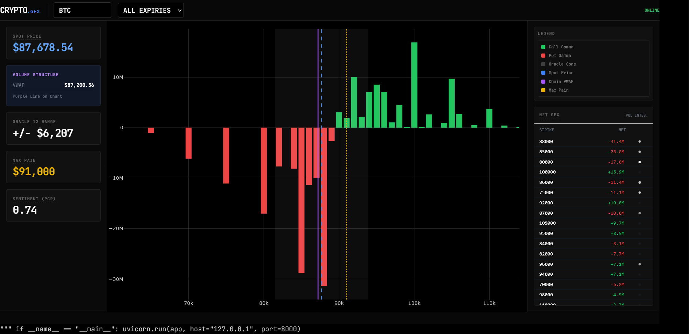

# Crypto.GEX

**Real-Time Institutional Options Analytics Terminal.**

A high-performance, localized financial telemetry engine for analyzing Deribit option chains. Designed with a **"Split-Brain" architecture**, it combines a robust Python backend for high-throughput data ingestion with a client-side JavaScript math engine for zero-latency Black-Scholes calculations.

This tool provides a "naked" look at market structure, stripping away retail noise to reveal Dealer Gamma Exposure (GEX), Volatility Cones, and Volume-Weighted structural levels in real-time.

## Interface


*Real-time analytics dashboard displaying Net Gamma Ladder, Volatility Oracle Cones, and Volume-Weighted Average Price (VWAP) structure.*

---

## Quantitative Methodology

### 1. Data Ingestion (The Engine)
Built on an asynchronous `aiohttp` pipeline that maintains persistent WebSocket connections to Deribit.
* **Dual-Universe Fetching:** Simultaneously queries inverse (BTC/ETH) and linear (USDC) option pairs to ensure complete market coverage.
* **Fault Tolerance:** Implements "Clean Core" error handling to suppress API noise while maintaining stream integrity during disconnection events.

### 2. Gamma Exposure (GEX)
Calculates the real-time hedging exposure of market makers using the Black-Scholes model. Positive GEX implies mean-reverting behavior (dealers buy dips/sell rips), while Negative GEX implies acceleration (dealers trade with the trend).

$$GEX = \frac{e^{-d_1^2/2}}{S \sigma \sqrt{T} \sqrt{2\pi}} \times OI \times S^2 \times 0.01$$

* **Dynamic Risk-Free Rate:** Integrates adjustable rates (default 5%) for precise Greek derivation.
* **Net Aggregation:** Sums Call GEX (Long) and Put GEX (Short) per strike to identify "Gamma Walls."

### 3. Volatility Oracle (1$\sigma$)
Projects the expected price range based on the Open Interest-weighted Implied Volatility (IV) of the active chain.
* **The Cone:** Visualizes the 68% probability bounds for price action over the selected timeframe.
* **Formula:** $\text{Range} = S \times \text{Weighted IV} \times \sqrt{T}$

### 4. Market Structure Metrics
* **Chain VWAP:** Calculates the "Center of Gravity" for the day's volume ($\frac{\sum (K \times Vol)}{\sum Vol}$), acting as a dynamic support/resistance level anchored in real money flow.
* **Max Pain:** Identifies the strike price where option writers (dealers) face the minimum financial liability at expiry.
* **Sentiment (PCR):** Real-time Put/Call Ratio based on Open Interest.
    * $> 1.0$: Bearish (Hedging Dominant)
    * $< 0.7$: Bullish (Speculation Dominant)

---

## Project Structure

```text
Crypto.GEX/
├── app.py             # Backend (FastAPI + Data Aggregation + WebSocket Stream)
├── index.html         # Frontend (Plotly Charts + Black-Scholes Math Engine)
├── requirements.txt   # Dependencies (fastapi, uvicorn, aiohttp, numpy)
└── README.md          # Documentation
